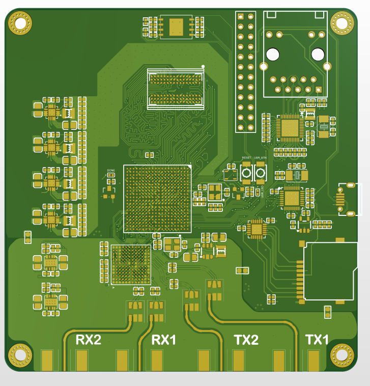
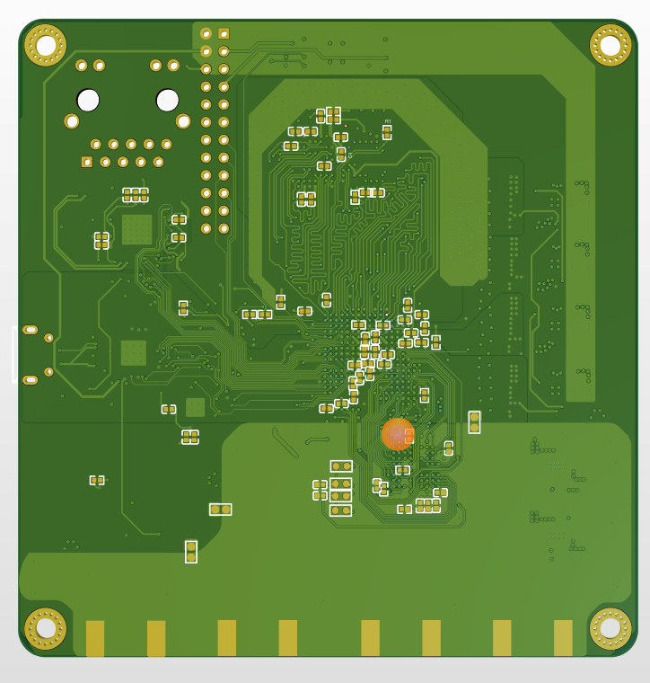

# ZYNQ7010/7020_AD9363
# 目前遇到的bug，设计时为了布线方便差分对跨bank了，由于速度不是很高可能问题不大。第二个bug是用没有时钟输入功能的io接收ad9363的数据时钟。
# 这两bug目前来说可以用软件去修复，目前不建议自己打板等第三版吧。
####  基于ZYNQ+AD9363的开源SDR硬件

##### 1.硬件方案

FPGA:ZYNQ7010/7020(ZYNQ7010和ZYNQ7020可以相互代换，如需更多硬件资源请使用ZYNQ7020)

RF:AD9361/AD9363/AD9364(三款芯片可相互代换，区别在于频宽不同。其中AD9361性能更为优秀，尽量使用ABCZ结尾的芯片，区分于BBCZ)

内存：DDR3 256M16

USB-PHY: USB3320C

GMAC-PHY: RTL8211E-VL(RTL8211E有VB和VL两个结尾，其中VB电平为3.3V/2.5V,VL为1.8V)

QSPI FLASH: W25Q256 32MB

##### 2.软件资源

支持Pluto-SDR固件移植、OpenWiFi(需选用ZYNQ7020 FPGA)

##### 3.PCB板设计

设计软件：Altium Designer

层数：4层 （信号层[1]、power[2]、GND[3]、信号层[4]）

工艺：嘉立创工艺

阻抗：不支持

目前正在测试，bug情况未知，打板请谨慎。有问题可发邮件：1399109998@qq.com

# 2020/11/19更新，测试遇到重大bug。ddr数据线组内交换没有严格参照xilinx手册，导致ddr测试无法通过，正在着手修改，不要打板，这个bug无法通过软件修复，请等待最新的设计文件。

# 2020/12/07更新，重新设计DDR走线，ad9363部分增加一个收发通道,未测试。

