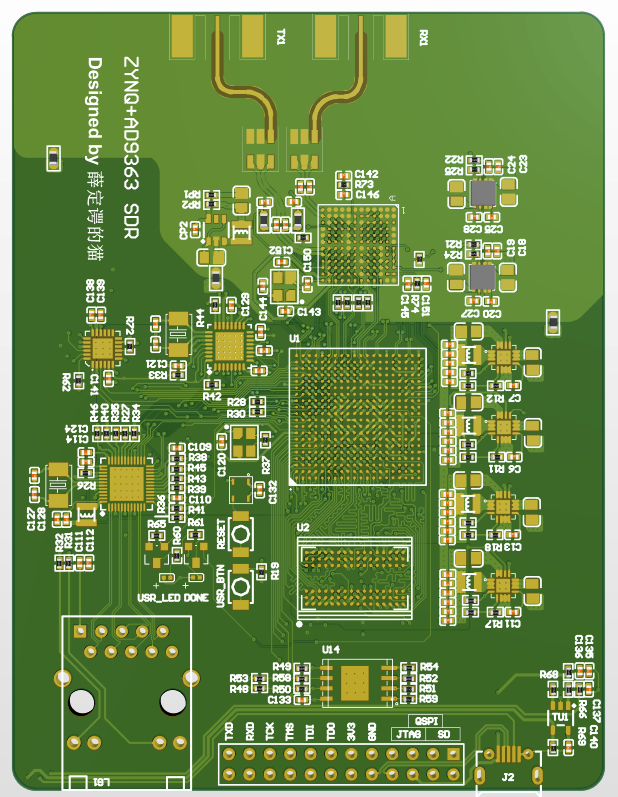
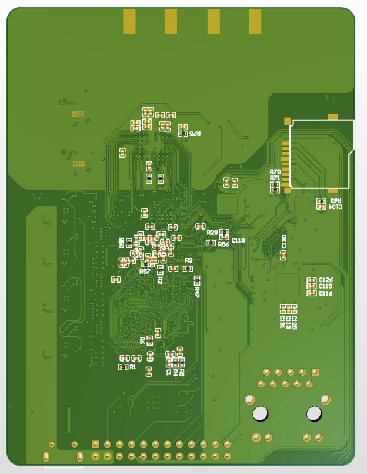
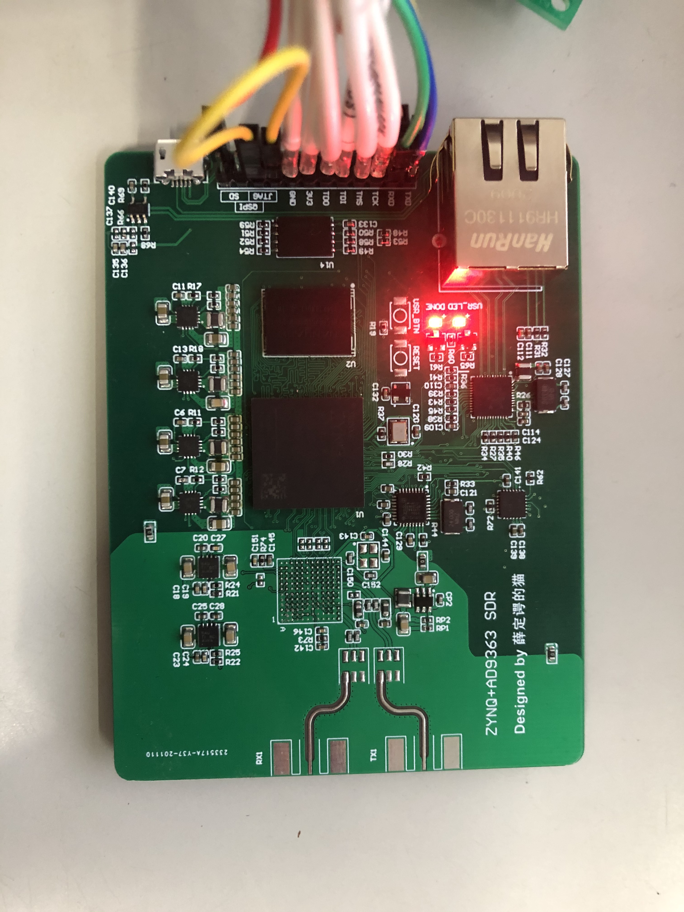
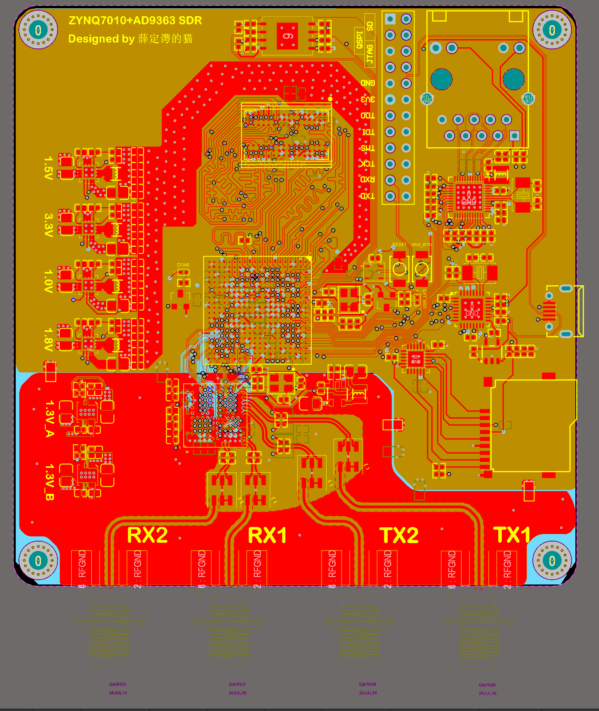
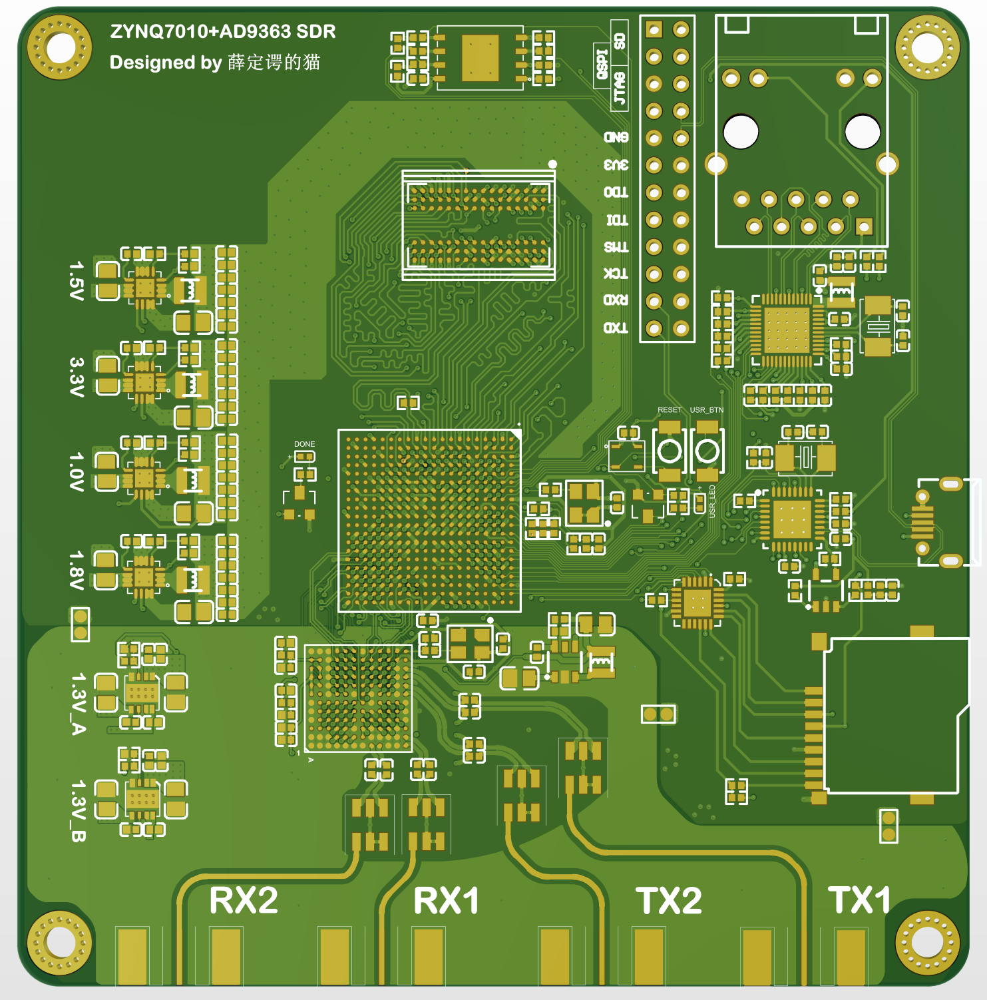
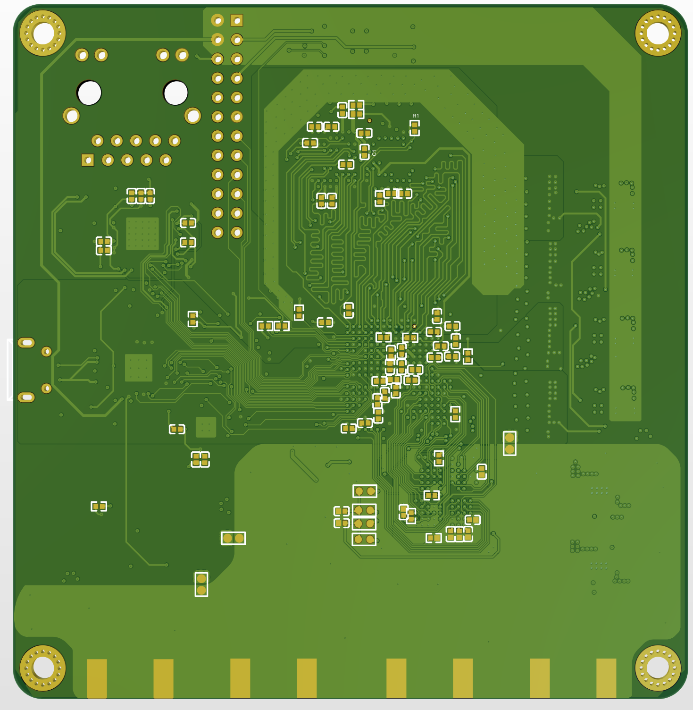

# ZYNQ7010/7020_AD9363/AD9364/AD9361
####  基于ZYNQ+AD9363的开源SDR硬件

##### 1.硬件方案

FPGA:ZYNQ7010/7020(ZYNQ7010和ZYNQ7020可以相互代换，如需更多硬件资源请使用ZYNQ7020)

RF:AD9361/AD9363/AD9364(三款芯片可相互代换，区别在于频宽不同。其中AD9361性能更为优秀，尽量使用ABCZ结尾的芯片，区分于BBCZ)

内存：DDR3 256M16

USB-PHY: USB3320C

GMAC-PHY: RTL8211E-VL(RTL8211E有VB和VL两个结尾，其中VB电平为3.3V/2.5V,VL为1.8V)

QSPI FLASH: W25Q256 32MB

##### 2.软件资源

支持Pluto-SDR固件移植、OpenWiFi(需选用ZYNQ7020 FPGA)、支持adi官方ZED+AD-FMCOMMS2/3/4相关固件代码

软件上支持MATLAB、GNU Radio、SDR sharp等

##### 3.PCB板设计

设计软件：Altium Designer

层数：4层 （信号层[1]、GND[2]、POWER[3]、信号层[4]）

工艺：嘉立创工艺

阻抗：不支持

目前正在测试，bug情况未知，打板请谨慎。有问题可发邮件：1399109998@qq.com

第一个本版（硬件设计有问题已废弃）

第二个本版（更改ddr走线，lvds走线、增加收发模组为2r2t）目前正在测试这个版本

已经对这个版本进行了pluto固件的适配

